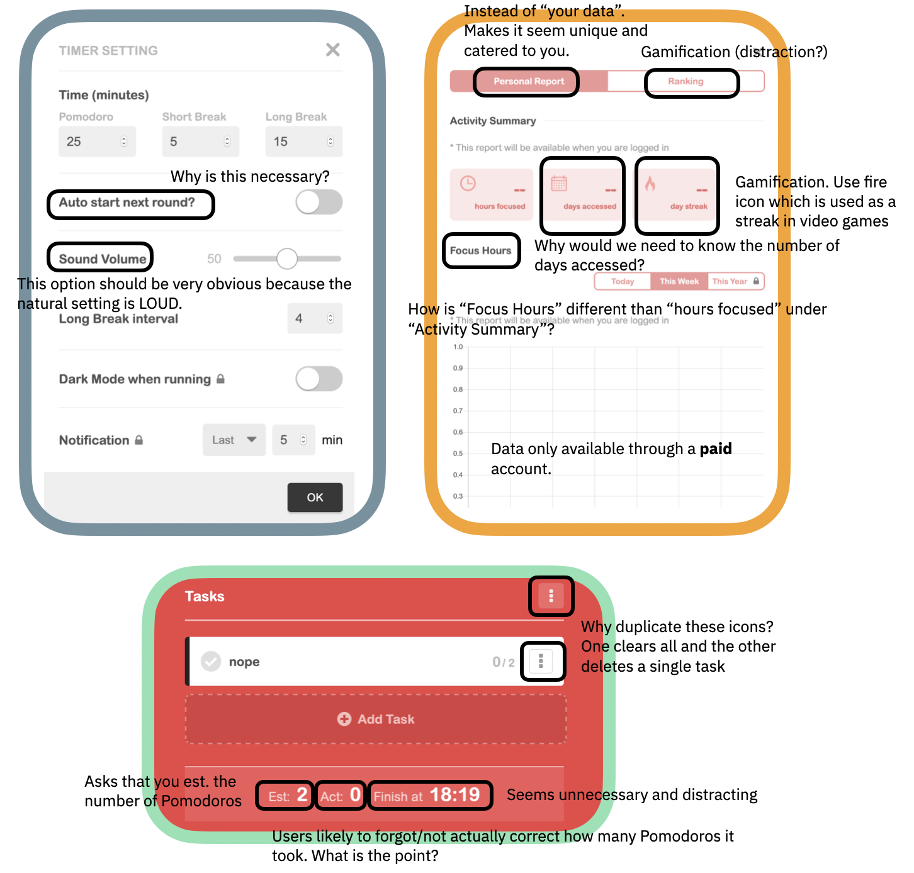

# Exercise 1

### :tomato: &nbsp; PART 1
Before you forgot them, list all your thoughts and creative ideas on the Pomodoro Timer we will build! Do you want to modify the technique? Do you have specific features in mind? Are there UI components you want to add? If you would prefer to use another tool (e.g. sticky notes, block diagrams), do that!

*Need to have an emphasis on discoverability, feedback, and focus. The point of the app is to improve productivity and time management. Therefore, it should limit distractors, NOT contribute as a cognitive load, and hold people to the Pomodoro technique. This means we should have a start + end (NOT STOP bc that acts like a pause). It should not be distracting in color/noise. How do we notify people without being annoying? Like the idea of obvious timer, progress bar, feedback at end of day on Pomodoro-ing, force people to take breaks. Should NOT be a todolist or require # of Pomodoros because that's taking away from the point at hand. Love the satisying clicks + color changes of the pomofocus.*

---

### :tomato: &nbsp; PART 2  

Timer: [PomoFocus](https://pomofocus.io/) 

---

### :tomato: &nbsp; PART 3

#### Setup
1. Was there a prompt to set the number of Pomodoros? 
2. Was there a prompt to set the Pomodoro or break time? 
3. What options (buttons, fields to enter) were given? (E.g. 'pause' button).
4. Were you asked to log in/create an account?
5. Was it obvious that it was a *Pomodoro* timer? How did you know?

#### Work Session/Pomodoro
1. What **cues** indicated it was Pomodoro/work time? For example, *visual cues* can include a change of color or a label of "work time"; *audio cues* could consist of a ticking noise.
2. Was there any **feedback** on your progress? (E.g. bar at top of screen, percentage, time left).
3. Was a clock the main feature? If so, please describe it (e.g. analog). If not, what was the main featue?
4. Did the interface distract you? (E.g. flashing, bright colors, etc.).
5. Did the interface help you focus? (E.g. silence notifications).

#### Transition
1. When the app switched from work to break, was there a **color** change? Did you like it?  
    **Yes, the color changed from red to blue. It was very satisfying.**

2. When the app switched from work to break, was there a **sound** effect? Did you like it?  
    **I found that the icon for 'Start' and 'Stop' when pressed had a very satisying clicking sound.**

3. How did the app notify you to switch? Did you get a notification? A sound? Something in your browser?  
    **I got startled the first time I heard it because I wasn't expecting a sound icon especially one that loud and alerting. I felt jerked out of my concentration.**

#### Break Session
1. How did you know if it was a short or long break?
2. Were you given the option of (a) skipping a break, (b) short break, (c) long break? Or did you have no choice?
3. What **cues** indicated it was break time? For example, *visual cues* can include a change of color or a label of "break time"; *audio cues* could consist of the sound of ocean waves.
4. ...

#### End
1. How did you end your session? 
    Just hit 'STOP'.

2. Did you see how many Pomodoros you accomplished? If so, how was this provided?
    There is a bar at the top of the screen where you can click 'Report'. It will show the # hours focused, # days accessed, and # day streak. It also adds a gamification component of showing your 'ranking'. However, the report can only be accessed with an account.

3. ...

#### Additional Comments

---

### :tomato: &nbsp; PART 4 (Bonus)

#### Data
1. How many Pomodoros did you do?  
   **7**.
2. Did you cancel/forfeit any Pomodoros? Why?  
    **Yes, I got pulled into a phone call. However, the app I was using didn't have a "forfeit"/"stop" button just "pause".**
3. How many short breaks did you take?  
    **Just 1.**
4. How many long breaks did you take?  
    **Just 1.**
5. How did you time yourself? (E.g. phone clock app or specific Pomodoro app)  
   **I used Pomo Focus (Part 2).**
6. What device did you use for this timer? (E.g. phone, laptop)  
    **Laptop. But I was curious if apps would let us silence notifications.**

#### Experience
1. Did you initially plan how many Pomodoros you wanted to spend or did you wing it?
2. If you planned the number, was this challenging or easy?
3. Did you feel your productivity increased?
4. Did you use traditional 25 minutes or did you modify that (E.g. 35 minutes)?
5. Would you consider modifying the 25 minutes in the future?
6. Did you feel like you often skipped a break?
7. Did you often extend your break into a longer one?
8. Would you use this technique again?
