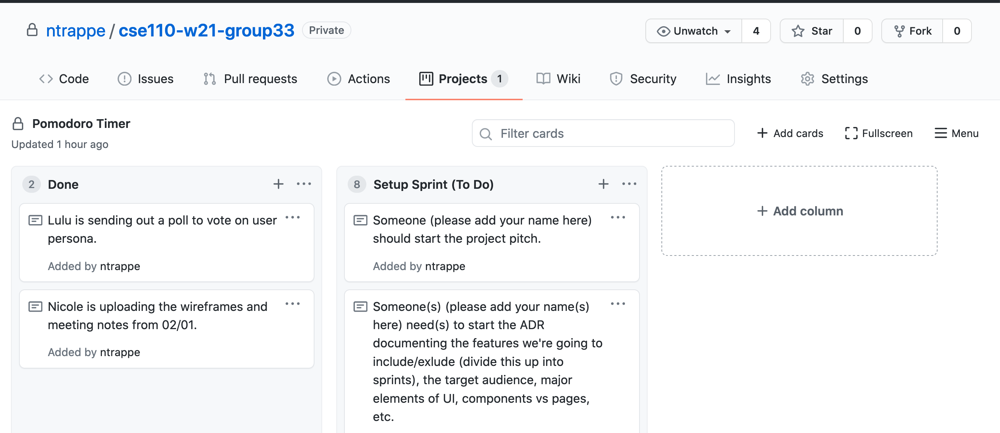

# Setup/First Sprint Part 2
##### Team: Powell's Owls | Group 33

### Overview
| Date       | Time      | Type of Meeting   | Where   |
| ---------- | --------- | ----------------- | ------- |
| 02/04/2021 | 6-7pm PST |          | Zoom    |

### Prep
If you're very confused about what's currently happening, review the [meeting notes](https://github.com/ntrappe/cse110-w21-group33/blob/main/admin/meetings/02-01-21-first-sprint.md) from Monday. Otherwise, please **SIGN UP FOR TASKS BELOW**. Most of these tasks require 2 people.

---

**1. User Centered Thinking Documents.**  
You need to formally document your project's target audience, including [personas](http://opendesignkit.org/methods/personas/), 
[user stories](https://en.wikipedia.org/wiki/User_story), and optionally [use cases](https://en.wikipedia.org/wiki/Use_case)
(which document a broader set of activities the user has with the system, focused more on the task than the user's needs).

**:pencil: Team Members**:

---
  
**2. ADRs.** As your team makes decisions, you should be filling out [ADRs](https://adr.github.io/madr/) documenting your decisions and reasons. What features are you going to include/exclude? Who is your target audience? What are the major elements of your UI design? How do you break your architecture up into components/pages? All these decisions and more should be documented in ADRs. We'll be asking for retrospectives later in the term, and well-made ADRs make it much easier to reflect on your expectations/reasoning and compare it with the outcome.

#### Notes:
- Many of the features we mentioned adding or not adding are in the Meeting Notes from Week 4
- It may be good to mention the essential features then ones we want for later sprints (and classify them that way)
- Explain why we chose what we did and how it meets specific *user needs*

**:pencil: Team Members**: 

---

**3. Interface Designs.**  
Start sketching out your app's UI! It's good to incrementally design these in increasing levels of detail. Start with a [fat marker sketch](https://basecamp.com/shapeup/1.3-chapter-04) to get a general idea. Move on to [wireframes](https://www.experienceux.co.uk/faqs/what-is-wireframing/) once you've begun converging on a design. Finally, once you're confident, move on to a detailed mock-up that lays out exactly how each page should look. Don't just jump to the latter stages--you might spend a lot of time designing something that doesn't work!

#### Notes:
- Nicole did wireframes during Monday's meeting

**✅ Team Members**: Nicole & Lulu

---

**4. System Diagrams**  
You need to formally document your application's architecture. These can take multiple forms, including [C4](https://c4model.com/), [event modeling](https://eventmodeling.org/posts/what-is-event-modeling/), and [UML diagrams](https://en.wikipedia.org/wiki/Unified_Modeling_Language#Diagrams). This isn't an either/or choice. Since each of these focus on different (albeit sometimes overlapping) parts of the system, you should have a mixture of these to describe your whole system. I'd recommend starting with C4 and going from there, but the choice is up to you.

#### Notes:
- there's an inital version in [/specs](https://github.com/ntrappe/cse110-w21-group33/blob/main/specs/brainstorm-prep-spec.md)

**:pencil: Team Members**:

---

**5. Project Pitch.** Condense your brainstorming and design documents above into a single project pitch that you'll deliver for me. Treat it like you're pitching your project for upper management/an outside company, meaning you need to describe every aspect of your system like I'm an outsider: the problem, audience, architecture, UI design, features, roadmap, etc. To see how you should structure your pitch, see [chapter 6 from Shape Up](https://basecamp.com/shapeup/1.5-chapter-06). You can reuse your existing diagrams, but the pitch itself should be a separate document with the diagrams copied inside.

**:pencil: Team Members**: 

---

**6. Project Roadmap.**  
Divide features into sprints. As discussed in class, there are four total sprints. How will you divide work between the sprints? What is your MVP for sprint 2, and what are your stretch goals for sprint 3? Will you leave flex time for cleanup/refactoring/debugging/finishing features?

**:pencil: Team Members**: Whole Team (will be done in this meeting)

---

**7. Glossery.**  

**✅ Assigned To**: Lulu

---

**8. HTML/CSS/JS Guidelines**  
Acronyms are often useful and efficient, but have an on boarding cost. Try to speak a common dialect other than a project specific one

**✅ Assigned To**: Richard

---

**9. Pair Work Documentation**  
Def TBD

**✅ Assigned To**: Bryant

---

**10. Assigning Pairs**  
Def TBD

**✅ Assigned To**: Vy

---

ALSO go to **Projects** > **Pomodoro Timer** > **Setup Sprint (To Do)** and add your name to the specific note with the task that matches the one you chose above.

---

### Attendance
- [ ] Michael Donaldson
- [ ] Richard Duong
- [ ] Brandon Liu
- [ ] Bryant Shao
- [ ] Steven Steiner
- [ ] Nicole Trappe
- [ ] Vy Truong
- [ ] Felix Zhang
- [ ] Lulu Zhu
