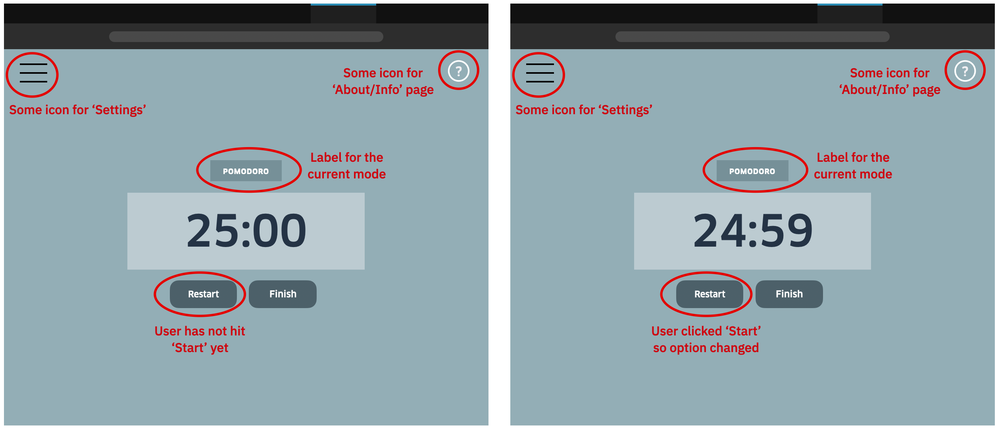
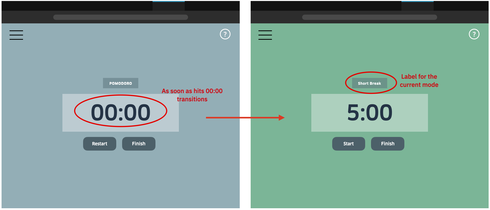

# Roadmap

## Sprint #1 (MVP)
### Features Overview
- Timer (minutes, seconds)
- Button that toggles between "reset" and "start"
- Button for "finish" 
- Info/About Page (lightbox) with icon
- Sidebar for settings
- Different background color for each mode (Pomo - color1, Short Break - color2, Long Break - color3)
- Label for the mode (e.g. "Short Break")

### Feature Specifications
- **Feature 1: Timer**: 
  - function: displays minutes and seconds; decrements from initial number to 00:00 
  - inputs: 
    - "reset" signal: resets the timer to the appropriate number for the mode
      - e.g. reset for **Pomo**: 25:00; reset for **Short Break**: 5:00; reset for **Long Break**: 15:00
      - a reset DOES NOT start the timer
      - if gets a reset in the middle of a Pomo/break, starts that session over and does not move on to the next one
    - "start" signal: starts decrementing until hits 0:00 or gets a "reset" signal
  - outputs:
    - TBD but may send a signal to Central Control when hit 00:00 to determine next mod
  - UI: should be front and center and the most prominent element in the screen
- **Buttons**: user-controlled interactions
  - **Start**: will start the count-down of the timer (the timer must wait for this command)
    - once start is clicked, it will swapped with 'restart'
  - **Restart**: will reset the timer (e.g. if timer was at 22:59, it will go back to 25:00)
    - the user can restart both Pomorodors and breaks
    - once restart is clicked, it will swapped with 'start'
    - if the timer hits 00:00 then that counts as a successful Pomodoro, a reset will restart *that* Pomodoro
      - e.g. if I was on Pomo #2 and was interupted and re-started the clock, I'm still in #2
  - **Finish**: ends the session; in future sprints, this will show a record of the session's Pomodoro's (but for this sprint, it might not do anything)
    - by session I mean the day of work
    - may change the word label of this
  - buttons will be below the timer and easy to access
  - there should be visible feedback for the hover + click
- **Color**: ideally have a different background color for each mode (Pomodoro, Short Break, Long Break)
  - all colors should be blues/greens/calm colors that are not distracting (e.g. not red lol)
- **Settings**:
- **Label**: above the timer, we should have a written label for the mode we are in rather than *just* relying on background color
  - e.g. in Pomodoro, the label has "Pomodoro"
  - when the timer hits 00:00, it will change to the next mode and the label accompanying that will change
- **Info/About page**: page will hover over the current window with information on the Pomodoro techniue and specific features
  - need to decide on what signifier we will use to allow the user to find this page (e.g. 'About', '?' icon, button, etc.)
  - we can decide if the user can also modify specific features while in this info page
    - example: "Did you know you can set audio notification" could have a button for that that doesn't just mirror the actual features in settings but also will change audio 
    
    
### Internal Features
- **Counter**: we need some way of tracking both the total number of Pomodoros/short breaks/long breaks completed tht day for the record BUT also we need to count 4 Pomodoros towards a **set** that will then transition the timer into "long break"
- **Central Control**: we need a way to switch the timer into the different modes: Pomodoro, Short Break, & Long Break

---

**Feature Model**

---

## Sprint #2
### Features
- **Audio Notifications**: allow the user to receive a noise that prompts them to react (e.g. press Start) and to go into next transition
  - **Feature #1**: (in settings) allow the user to set the volume
  - **Feature #2**: (in settings) allow the user to select the type of noise from a short list
    - each time they select one, it will make the sound instantly so they can "sample it"
  - **Feature #3**: (in settings or main) allow user to turn on and off audio
- **Tab Bar**: in the browser tab, allow the current timer time to be displayed
- **Calm Mode**: (in main) allow user to switch to 'calm' mode that will represent timer with just minutes NOT seconds
  - e.g. the timer will show "25m" --> user hits start --> "24m"; the tab bar will mirror that an display "24m"
- **Cookies**: (maybe for Sprint #3) use cookies to save user info in their browser:
  - in case user closes window or refreshes it, their most recent mode will remain the same (but restarted)
    - e.g. if in pomodoro #3 and hit refresh before it ended --> pomodoro #3 will be reset
  - potentially reset cookies at 4am local time to clear it for next day session
    - since our users are undergrads, many work up until 2am so we shouldn't reset at midnight
