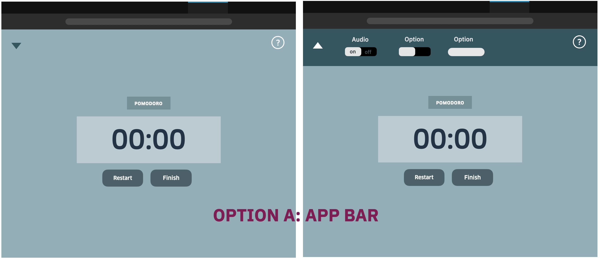

# User Interface Designs

### Settings
#### Option A: App Bar
The settings will appear when the user hits the arrow at the top of the screen and a panel will slide down. Each feature will be placed horizontally. To retract the settings panel, the user can click anywhere on the background of the panel or the triange. The triangle signifies if the panel has been retracted or dropped down based upon the direction. Example: arrow points down when it's restracted so the user indicates they want to pull it down.

