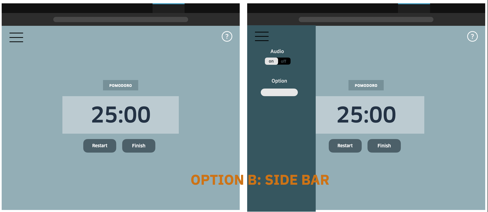
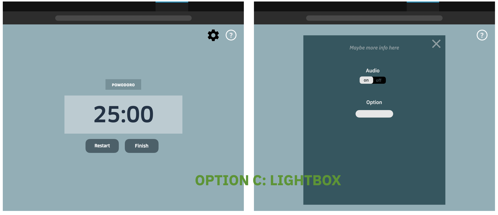

# User Interface Designs

### Settings
#### Option A: App Bar
The settings will appear when the user hits the arrow at the top of the screen and a panel will slide down. Each feature will be placed horizontally. To retract the settings panel, the user can click anywhere on the background of the panel or the triange. The triangle signifies if the panel has been retracted or dropped down based upon the direction. Example: arrow points down when it's restracted so the user indicates they want to pull it down.

#### Option B: Side Bar
The settings will appear when the user clicks on the 'Hamburger' icon (3 lines). When they click, a sidebar will expand (on the left in the image below) showing each feature vertically. To close the sidebar, the user can click anywhere on the main screen (aka timer/background panel) or the 'X' at the top of the sidebar. Most websites currently use the hamburger icon so we've been taught its meaning and it may be the more intuitive option. We have to decide on whether the sidebar would overlap/cover the timer or if the timer would dynamically shift to the right.

#### Option C: Lightbox
The settings will appear when the user clicks on the settings icon (a gear in the image below). They appear as a lightbox/window overlay on the page. The features are organized vertically. When the user wants the settings to go away, they can click on the 'X' on the page or anywhere outside of the overlay.

---

### Buttons
1. What kind of buttons will we use?
2. What feedback will we give? E.g. does it change colors or form slightly for a hover and press 

---

### Resizing
How does the browser look when the user has condensed it into:  
1. a small square window
2. a skinny, long vertical window
3. a skinny, long horizontal window
